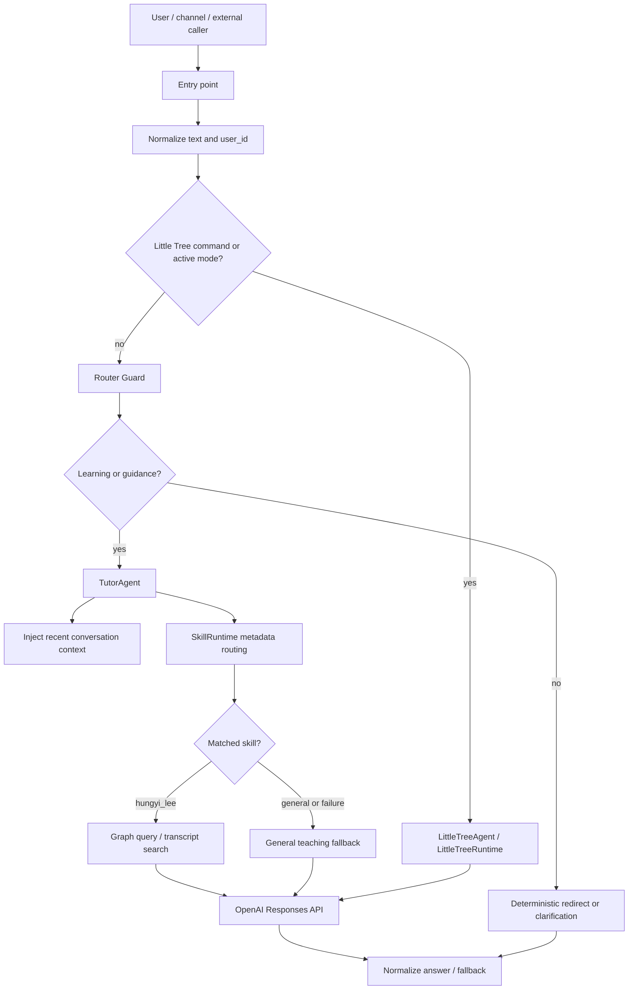

# Agent Card

## 1. Agent Name

| Field | Value |
|---|---|
| Formal name | AI Learning Tutor |
| Source agent identifier | `ai_learning_tutor` |
| External tutor API source | `ai-learning-tutor` |
| Specialized mode | Little Tree Companion (`little_tree_companion`) |

## 2. Version

TODO
Needs clarification.

The repository describes the system as an MVP and exposes model/runtime configuration through environment variables, but no explicit product or agent semantic version is defined in code or documentation.

## 3. Mission

Provide bounded AI/ML/LLM learning support through shared chat and API runtimes, using deterministic routing and grounded Hung-Yi Lee course-material retrieval when available.

## 4. Vision (Optional)

The architecture indicates a reusable assistant shell: channel adapters, deterministic guard, conversation context, skill runtime, and replaceable knowledge skills can be reused for future knowledge agents, enterprise assistants, and multi-agent integrations.

## 5. Target Users

| User group | Supported surface |
|---|---|
| AI/ML/LLM learners | LINE, Web Chat, Messenger, `/api/tutor/ask`, `/api/agent/ask` |
| Beginners seeking learning guidance or roadmaps | Same shared tutor runtime |
| External agents or systems needing a tutor capability | `/api/agent/ask` and `/api/tutor/ask` |
| LINE users using Rich Menu learning shortcuts | LINE webhook and asset replies |
| Children, parents, teachers, and volunteers in AI literacy mode | Little Tree Companion mode |

## 6. Role

- Learning Agent
- Knowledge Agent
- Bounded Tutor Agent
- Child-friendly AI Literacy Companion, only when Little Tree mode is active

## 7. Core Responsibilities

- Answer AI, machine learning, deep learning, LLM, RAG, MCP, AI Agent, and related learning questions.
- Provide beginner learning guidance, study direction, and concept explanations.
- Apply a deterministic learning-boundary guard before invoking the LLM.
- Route allowed learning questions to a skill runtime or a general teaching fallback.
- Prefer Hung-Yi Lee course-material retrieval for AI/ML tutoring when the `hungyi_lee` skill matches.
- Maintain short process-local conversation context by `user_id`.
- Expose the same tutor flow through LINE, Web Chat, Messenger, and HTTP APIs.
- Support explicit Little Tree mode for child, parent, teacher, and volunteer AI literacy support.
- Return deterministic fallback, clarification, redirect, timeout, or error messages instead of raw exceptions.

## 8. Out of Scope

- General-purpose open-ended chat outside the learning boundary.
- Image generation, drawing, roleplay, romantic companion behavior, fortune telling, tarot, astrology, resume writing, cover letters, poem/novel/email writing, or unrelated essay generation.
- Direct homework, exam, worksheet, report, or assignment completion in Little Tree mode; the runtime guides thinking instead.
- Unsafe or illegal child-mode requests, including self-harm, weapons, hacking, password theft, or illegal activity.
- Unsupported external agent tasks other than `answer_question`.
- Persistent long-term user profile management.
- Cross-instance memory, distributed quota, or distributed duplicate-event tracking.
- Autonomous modification of identity, personality, routing policy, or skill manifests at runtime.
- Authentication for `/api/agent/ask`; this endpoint is implemented as unauthenticated today.
- Medical, legal, financial, or other professional advice as a stated capability.

## 9. Core Capabilities

| Capability | Status | Implementation notes |
|---|---:|---|
| Conversation | Implemented | Shared tutor answer flow through `generate_tutor_answer()` and `TutorAgent.answer()` |
| Learning-boundary routing | Implemented | `router_guard.py` classifies learning, guidance, casual chat, tool misuse, and unknown input |
| Skill routing | Implemented | `SkillRuntime.route()` matches enabled skill metadata by domains and keywords |
| Grounded knowledge retrieval | Implemented | `hungyi_lee_skill.py` calls `hungyi_kb.py graph query`, then transcript search fallback |
| General teaching fallback | Implemented | `TutorAgent._general_teaching_answer()` uses an LLM teaching prompt |
| Short conversation memory | Implemented | Process-local in-memory context, six turns per user |
| Active skill state | Implemented | Process-local active skill map by `user_id` |
| Little Tree companion mode | Implemented | Command activation, intent classification, policy decision, deterministic starters, LLM fallback |
| External agent API | Implemented | `/api/agent/ask`, only `answer_question` |
| External tutor API | Implemented | `/api/tutor/ask` with API key, size validation, rate limit, daily quota, audit logging |
| Runtime observability | Implemented, gated | `/dashboard`, `/observability`, and `/api/runtime/telemetry` require `DASHBOARD_API_KEY` or `OBSERVABILITY_API_KEY` with `X-Dashboard-Key` |
| LINE channel | Implemented | `/callback`, signature validation, reply-then-push async flow, Rich Menu commands |
| Web Chat | Implemented | `GET /` and `POST /web-chat` |
| Messenger channel | Implemented, gated | Enabled only when `MESSENGER_ENABLED=true`; text messages only |
| Acronym disambiguation | Implemented | MCP and AI-domain hints injected into prompts |
| Delegation to other agents | Not implemented as outbound delegation | Other agents can call this agent; this agent does not call external agents |

## 10. Runtime Overview

Operational summary:

1. Channel or API code validates and normalizes the incoming request.
2. `generate_tutor_answer()` checks Little Tree activation or active Little Tree mode first.
3. Normal tutor flow passes through `route_learning_boundary()`.
4. Allowed messages enter `TutorAgent.answer()`.
5. The tutor injects recent per-user context and acronym hints into prompts.
6. `SkillRuntime` routes by enabled skill metadata.
7. The selected skill is invoked through `ModuleSkillAdapter`; failures fall back to a general teaching prompt.
8. Successful user and assistant turns are stored in process-local memory.
9. Channel-specific layers format, truncate, push, or return the response.

## 11. Tool / Skill Usage

### Runtime tools and external services

| Tool/service | Usage |
|---|---|
| OpenAI Responses API | Primary LLM generation through `ask_gpt()` |
| Hung-Yi Lee knowledge CLI | Local subprocess call to `skills/hung-yi-lee-skill/scripts/hungyi_kb.py` |
| LINE Messaging API | Reply/push messages and Rich Menu image/text replies |
| Facebook Graph Send API | Messenger text replies |
| Flask | HTTP application, web chat, webhook, and API routes |
| Gunicorn | Production server in Dockerfile |

### Skills

| Skill | Entry point | Capability |
|---|---|---|
| `hungyi_lee` | `skills.hungyi_lee_skill` | `answer_ai_learning_question`, `grounded_tutoring` |
| `little_tree_companion` | `skills.little_tree_companion` | `child_friendly_learning_companion` |

### Agent/API collaboration

| Endpoint | Collaboration shape |
|---|---|
| `POST /api/agent/ask` | External agents call `answer_question`; accepts legacy and capability-style payloads |
| `POST /api/tutor/ask` | Authenticated external tutor API with API key, rate limit, quota, and audit logging |

Current implementation supports inbound calls from other agents. It does not implement outbound delegation to other agents.

## 12. Memory Policy

The agent is not stateless. It has process-local, non-durable memory.

| Memory type | Scope | Persistence |
|---|---|---|
| Conversation turns | Stored by `user_id`; max six turns, or twelve messages | In memory only; lost on process restart |
| Active skill state | Stored by `user_id`, e.g. Little Tree active mode | In memory only; lost on process restart |
| LINE duplicate-event cache | Process-local event key TTL | In memory only |
| Tutor API rate limits and quotas | Process-local dictionaries | In memory only |

Operational telemetry is separate from conversational memory. The local
`data/runtime_telemetry.jsonl` file is a lightweight append-only observability
log for request counts, provider/model usage, latency, token totals, fallback
status, and error type. It must not be used for user personalization, long-term
conversation recall, or tutor memory. It is protected behind the dashboard
API key and is not part of the agent memory model described above.

The implemented memory can record:

- User messages.
- Assistant replies.
- Active skill selection for a user.
- Temporary webhook duplicate-event keys.
- Temporary API request timestamps and quota counts.

The implemented memory does not provide:

- Durable user profiles.
- Long-term personalization.
- Cross-process or cross-instance synchronization.
- Database-backed conversation history.
- Vector memory.
- Explicit user consent or deletion workflow beyond `clear_context()` in code/tests.

## 13. Responsibility Boundary

### Handled by this agent

- AI/ML/LLM learning questions inside the router guard boundary.
- Beginner learning guidance and roadmaps.
- Hung-Yi Lee material retrieval and teaching response composition.
- Little Tree child-friendly AI literacy interactions when activated.
- Channel orchestration for LINE, Web Chat, Messenger, and HTTP API responses.
- Fallback behavior for empty responses, timeouts, skill failures, OpenAI errors, and unsupported tasks.

### Must reject or redirect

- Casual chat outside the learning product boundary.
- Tool misuse requests listed in the deterministic guard, including image generation, roleplay, fortune telling, unrelated writing, and similar non-learning tasks.
- Unknown or ambiguous messages that do not clearly express an AI-learning intent.
- Unsupported `/api/agent/ask` tasks.
- Invalid `/api/tutor/ask` requests: missing API key, wrong key, oversized payload, invalid or overlong question, quota exceeded, or rate limit exceeded.
- Little Tree unsafe or illegal requests.

### Requires delegation

This project uses delegation primarily to internal skills, not other agents.

- AI/ML grounded tutoring delegates to `hungyi_lee`.
- Child-friendly AI literacy delegates to `little_tree_companion` or `LittleTreeAgent`.
- General fallback delegates only to the configured LLM caller.

TODO
Needs clarification: future outbound multi-agent delegation policy is not implemented in the current codebase.

## 14. Safety

| Safety mechanism | Implemented behavior |
|---|---|
| Router Guard | Deterministic pre-LLM boundary in `router_guard.py`; only `learning` and `learning_guidance` are allowed into tutor runtime |
| Tool misuse blocking | Blocks image generation, roleplay, romantic companion, fortune telling, unrelated writing, and similar requests before LLM invocation |
| Clarification path | Unknown intent receives clarification instead of LLM invocation |
| Little Tree policy | Detects unsafe/illegal terms and homework guidance; refuses unsafe requests and guides homework instead of answering directly |
| LINE signature validation | `/callback` uses LINE webhook signature handling |
| LINE duplicate guard | In-memory duplicate-event protection with TTL |
| Tutor API authentication | `/api/tutor/ask` requires `X-API-Key` and configured `AI_TUTOR_API_KEY` |
| Observability authentication | `/dashboard`, `/observability`, and `/api/runtime/telemetry` require `X-Dashboard-Key` and configured `DASHBOARD_API_KEY` or `OBSERVABILITY_API_KEY` |
| Tutor API validation | Payload size limit, question type/length validation, rate limit, daily quota |
| Tutor API audit logging | Logs timestamp, client IP, source, user ID, question length, status, and duration; tests verify key and answer are not logged |
| Messenger enable gate | Messenger routes return 404 unless `MESSENGER_ENABLED=true` |
| Fallback normalization | Empty, `None`, exception, timeout, and skill failure paths return fallback responses |
| Persona guardrails in Hung-Yi skill | Skill instructions prohibit claiming to be Hung-Yi Lee, negative evaluations of specific entities, sexual jokes, and political jokes |

No separate policy engine, semantic safety classifier, persistent abuse store, or prompt-injection defense layer is implemented beyond the deterministic guards, prompt instructions, request validation, and endpoint authentication described above.

## 15. Current Limitations

- No explicit product or agent version is defined.
- Conversation memory is process-local only and lost on restart.
- Active Little Tree mode is process-local only.
- LINE duplicate-event protection is process-local only.
- API rate limits and daily quotas are process-local dictionaries, not durable or distributed.
- `/api/agent/ask` has no authentication.
- Only one external agent capability is supported: `answer_question`.
- Skill routing is keyword/metadata based, not semantic.
- Hung-Yi retrieval depends on a local subprocess call to `hungyi_kb.py`.
- Hung-Yi context is truncated by character count, not token-aware context packing.
- Messenger support is text-only and ignores attachments, delivery events, read events, and echoes.
- Web Chat is a lightweight demo surface, not an authenticated stateful web application.
- Dockerfile runs one Gunicorn worker with threads; increasing workers would split process-local state.
- Many Traditional Chinese strings in the current repository appear mojibake-damaged, making user-facing copy and routing terms harder to maintain.
- The codebase contains both `agents/router.py` and `SkillRuntime.route()`; the active tutor path uses `SkillRuntime.route()`.
- Safety is rule-based and prompt-based; there is no independent safety model or persistent enforcement service.
- There is no persistent analytics, user profile, consent, or data-retention subsystem.

## 16. Future Roadmap

The architecture document identifies evolution points implied by the current implementation:

- Expand from a single knowledge agent into a catalog of skills.
- Improve skill routing while preserving deterministic product-boundary checks.
- Replace local static knowledge scripts with RAG services, document indexes, or other retrieval backends.
- Extend external APIs so other agents can call additional future capabilities.
- Reuse the runtime shell for enterprise assistants or other knowledge assistants by swapping skills, prompts, routing terms, and retrieval sources.
- Add multi-agent behavior above the current tutor API, where other agents can call `answer_question` or future capabilities.

TODO
Needs clarification: no dated roadmap, release plan, owner, or committed milestones are present in the current repository.

## 17. Change History

The repository does not include formal release notes. The following milestones are inferred from current files, tests, and architecture documentation.

| Milestone | Evidence in repository |
|---|---|
| Flask LINE Bot MVP | README, `main.py`, `Dockerfile`, LINE webhook and Rich Menu code |
| Hung-Yi Lee knowledge skill integration | `skills/hungyi_lee_skill.py`, `skills/hung-yi-lee-skill/`, skill manifest |
| Shared tutor runtime | `generate_tutor_answer()`, `TutorAgent`, `SkillRuntime`, architecture document |
| Router Guard boundary | `router_guard.py`, `tests/test_router_guard.py` |
| In-memory conversation context | `memory/conversation_context.py`, `tests/test_conversation_context.py` |
| External agent call-in API | README section and `/api/agent/ask` tests |
| Authenticated tutor API | `/api/tutor/ask` code and tests for API key, validation, quotas, audit logging |
| Little Tree mode | `agents/little_tree/*`, `skills/little_tree_companion.py`, Little Tree tests |
| Messenger integration | `messenger_webhook.py`, `messenger_client.py`, Messenger tests |
| Architecture extraction | `docs/architecture/AI_TUTOR_ARCHITECTURE.md` |

## Engineering Readiness Check

This Agent Card should allow another engineer to understand:

- The agent is a bounded AI learning tutor, not a general assistant.
- The main runtime is shared across LINE, Web Chat, Messenger, and HTTP APIs.
- The main grounded knowledge path is the Hung-Yi Lee skill.
- Little Tree is a separate active mode for child-friendly AI literacy.
- Memory and rate limiting are in-process only.
- External agent collaboration exists only as inbound API calls today.
- The system's safety posture is deterministic and rule-based, with endpoint validation and prompt guardrails, not a full policy engine.
