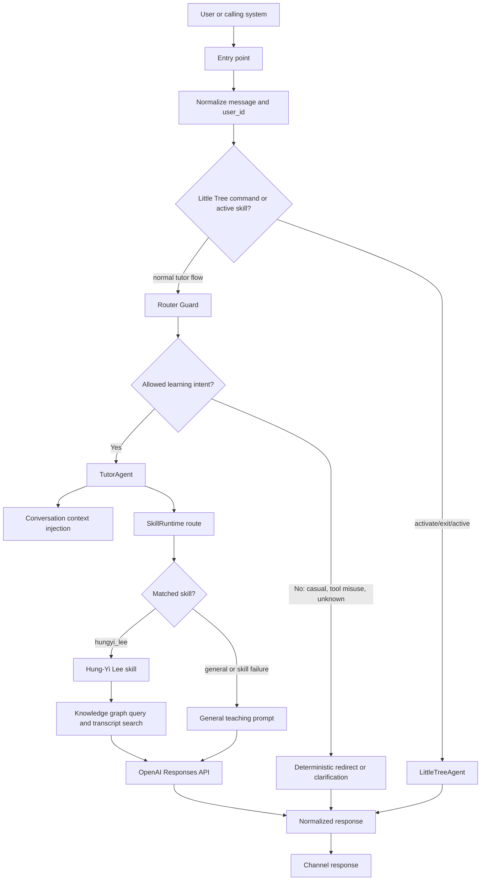
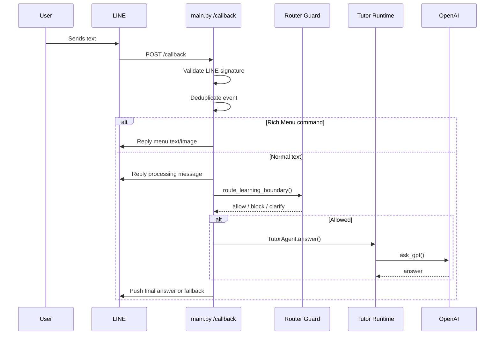
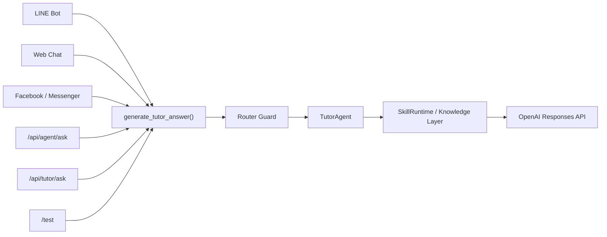
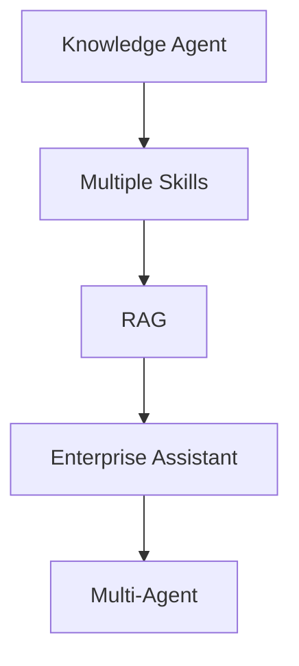

# AI Tutor Architecture

> **Retirement note:** Little Tree is retired from all user entry points. Its runtime, prompt, tests, and data remain in the repository as legacy implementation details.

This document describes the AI Learning Tutor architecture as it is implemented today. It is an extraction of the current codebase, not a proposal for an ideal future design.

## 1. Product Overview

### Purpose

AI Learning Tutor is a Flask-based tutoring service for AI, machine learning, deep learning, LLM, RAG, MCP, and AI Agent learning questions. It exposes the same tutor runtime through multiple chat entry points and uses a Hung-Yi Lee course-material skill as its main grounded knowledge source.

The product is centered on teaching and learning support, not open-ended general chat. A deterministic router guard checks whether a message belongs inside the learning boundary before the tutor runtime is invoked.

### Target Users

- Learners asking AI/ML/LLM study questions.
- Beginners asking for learning guidance, roadmaps, or explanations.
- External agents or systems that need to call a tutor capability through HTTP.
- LINE or Facebook/Messenger users interacting with the same tutor through chat channels.
- Little Tree users in a separate child-friendly AI literacy mode.

### Supported Entry Points

- LINE Bot webhook at `POST /callback`.
- Web Chat through the homepage and `POST /web-chat`.
- Facebook Page / Messenger webhook at `GET /webhook/messenger` and `POST /webhook/messenger`, gated by `MESSENGER_ENABLED=true`.
- External agent API at `POST /api/agent/ask`.
- External tutor API at `POST /api/tutor/ask`.
- Test query endpoint at `GET /test`.

### High-Level Product Goals

- Provide AI learning help through familiar chat surfaces.
- Keep routing predictable before involving the LLM.
- Ground AI/ML explanations in Hung-Yi Lee course materials when the routed skill can retrieve context.
- Preserve a reusable runtime shape so the same shell can support future knowledge assistants.
- Fail gracefully with clarification, redirect, timeout, or error fallback messages.

## 2. Runtime Flow

### Shared Tutor Lifecycle

Most entry points eventually call `generate_tutor_answer()` in `main.py`. That function handles Little Tree activation first, then applies the learning-boundary guard, then calls the tutor agent.



### LINE Flow

LINE uses an immediate reply plus asynchronous push pattern. The webhook replies first with a processing message, then pushes the final answer after background processing.



### Web Chat Flow

`GET /` renders `templates/index.html`. The browser posts messages to `POST /web-chat`. The route validates the message, defaults `user_id` to `web-demo` when none is provided, then calls `generate_ai_reply(..., truncate=False)`.

### Facebook / Messenger Flow

Messenger support is implemented through `messenger_webhook.py` and `messenger_client.py`. When enabled, verification is handled by `GET /webhook/messenger`. Text messages received by `POST /webhook/messenger` are filtered to ignore echoes, attachments, delivery, and read events. Valid text messages receive a processing message, then background execution calls the configured reply generator.

Messenger user IDs are namespaced as `messenger:<sender_id>` before entering the shared tutor runtime.

### API Flow

`POST /api/agent/ask` accepts both a legacy direct question format and a capability-style format. Only `answer_question` is supported today. It returns metadata including `source_agent`, `handled_by`, `capability`, `caller`, `call_id`, and fixed `"confidence": "medium"`.

`POST /api/tutor/ask` is stricter. It requires `X-API-Key`, validates request size and question length, applies process-local IP rate limits and API-key daily quotas, audits requests, then dispatches to the same tutor answer flow.

## 3. Core Components

### `main.py`

`main.py` is the application composition root. It owns:

- Flask app and routes.
- Environment configuration loading.
- LINE client and webhook handler setup.
- OpenAI client setup.
- Thread pools for webhook and AI work.
- Shared `ask_gpt()` wrapper around OpenAI Responses API.
- Construction of `TutorAgent` and `LittleTreeAgent`.
- Cross-channel answer functions: `generate_tutor_answer()`, `generate_ai_reply()`, and timeout wrappers.
- LINE duplicate-event protection.
- External agent and tutor API normalization, auth, rate limit, quota, and audit behavior.

Its boundary is orchestration. It does not contain the Hung-Yi Lee retrieval logic or skill metadata matching itself; those are delegated to agent, guard, and skill modules.

### `router_guard.py`

`router_guard.py` is the deterministic learning-boundary layer before the LLM. It classifies messages into:

- `learning`
- `learning_guidance`
- `casual_chat`
- `tool_misuse`
- `unknown`

Only `learning` and `learning_guidance` are allowed into the tutor runtime. Casual chat and tool misuse get a redirect message. Unknown messages get a clarification message. The guard deliberately fails open for replacement-character mojibake inputs so potentially valid learner messages are not blocked only because of encoding damage.

### Tutor Runtime: `agents/tutor_agent.py`

`TutorAgent` coordinates the core tutoring path after the guard allows a message. Its responsibilities are:

- Normalize the user message into a `SkillRequest`.
- Inject recent per-user conversation context into prompts.
- Add AI acronym disambiguation hints, especially around MCP.
- Respect active non-Little-Tree skills from conversation context.
- Route through `SkillRuntime`.
- Invoke the selected skill.
- Fall back to a general teaching prompt if routing selects `general`, the selected skill is missing, the skill raises, or the skill returns an empty answer.
- Store successful user/assistant turns in conversation memory.

### Tutor Client / LLM Caller

The OpenAI client is created in `main.py` from `OPENAI_API_KEY`. `ask_gpt(system_prompt, user_prompt)` calls `openai_client.responses.create()` with `OPENAI_MODEL`, defaulting to `gpt-4.1-mini`.

The LLM caller is injected into `TutorAgent`, `LittleTreeAgent`, and skill runtime configuration. This keeps runtime orchestration separate from the concrete OpenAI API call.

### Conversation Context: `memory/conversation_context.py`

Conversation context is process-local and in-memory. It stores recent turns by `user_id`, up to `MAX_CONTEXT_TURNS = 6` turns, or 12 individual messages. It also stores active skills by `user_id`.

The context module provides:

- `add_turn()`
- `get_recent_context()`
- `build_contextual_prompt()`
- `set_active_skill()`
- `get_active_skill()`
- `clear_active_skill()`
- `clear_context()`

No database or cross-instance storage is used today.

### Skill Runtime: `skills/runtime.py`

`SkillRuntime` is the metadata-driven routing and invocation layer. It owns:

- A `SkillCatalog` made of `SkillManifest` records.
- A `SkillContext` containing the injected `ask_gpt` function.
- Lazy loading of skill modules by Python import path.
- Metadata matching against domains and keywords.
- Adapter-based invocation through `ModuleSkillAdapter`.

Routing currently returns the first enabled skill whose domains or keywords match the normalized request text, sorted by priority. Otherwise it returns `general`.

### Skill Registry: `skills/registry.py`

The registry defines two enabled manifests:

- `little_tree_companion`, priority 200, command/keyword based.
- `hungyi_lee`, priority 100, for AI/ML/LLM/deep learning/generative AI tutoring.

The registry exposes the default catalog/runtime and helper functions for configuring, listing, and retrieving skills.

### Skill Adapters: `skills/adapters.py`

`ModuleSkillAdapter` lets legacy Python modules participate in the runtime if they expose `configure()` and `answer()`. It maps `SkillRequest` objects to a simple question string and calls the underlying module.

### Response Generation

Response generation is layered:

- Guard responses are deterministic strings.
- Rich Menu responses are deterministic text/image replies.
- Little Tree may return deterministic starter, guided-learning, homework-boundary, or refusal replies before calling an LLM.
- Hung-Yi Lee skill responses are LLM responses grounded with retrieved context when retrieval works.
- General tutor responses are LLM responses from a teaching prompt.
- Empty, `None`, exception, and timeout cases are normalized into fallback responses.

### Configuration

Configuration is environment-variable based. Important variables include:

- `OPENAI_API_KEY`
- `OPENAI_MODEL`
- `LINE_CHANNEL_ACCESS_TOKEN`
- `LINE_CHANNEL_SECRET`
- `PUBLIC_BASE_URL` / `BASE_URL`
- `PORT`
- `AI_REPLY_TIMEOUT_SECONDS`
- `PROCESSED_EVENT_TTL_SECONDS`
- `BACKGROUND_WORKERS`
- `AI_TUTOR_API_KEY`
- `MESSENGER_ENABLED`
- `MESSENGER_VERIFY_TOKEN`
- `MESSENGER_PAGE_ACCESS_TOKEN`
- `MESSENGER_API_VERSION`

## 4. Knowledge Layer

### Current Knowledge Source

The main domain-specific knowledge source is the Hung-Yi Lee skill:

- Runtime entrypoint: `skills/hungyi_lee_skill.py`
- Skill bundle: `skills/hung-yi-lee-skill/`
- Knowledge CLI: `skills/hung-yi-lee-skill/scripts/hungyi_kb.py`
- Material types: wiki pages, topic maps, graph data, query playbooks, series notes, transcripts, and raw YouTube transcript data.

The skill first attempts a graph query:

```text
hungyi_kb.py graph query <question>
```

If the graph result is missing or thin, it falls back to transcript search:

```text
hungyi_kb.py search <question> --limit 8
```

Retrieved context is truncated to `MAX_CONTEXT_CHARS = 12000` before it is inserted into a Hung-Yi-specific system prompt and sent to the LLM.

### Skill Modules

Skills are Python modules behind metadata manifests. Today the runtime includes:

- `hungyi_lee`: grounded AI/ML tutoring.
- `little_tree_companion`: child-friendly AI literacy mode, invoked explicitly through a command and active-skill state.

The skill contract is intentionally small: configure the LLM caller, receive a request or question, and return a string answer.

### Fallback Behavior

The knowledge layer is fail-open inside the tutor runtime:

- If Hung-Yi retrieval fails, `hungyi_lee_skill.answer()` logs the failure and calls `fallback_answer()`.
- If fallback GPT also fails, the skill returns a deterministic failure message.
- If the tutor agent cannot load or invoke a selected skill, it falls back to a general teaching answer.
- If the guard rejects the message, the knowledge layer is never invoked.

### Replaceability

The current runtime does not require Hung-Yi Lee materials specifically. The domain-specific parts are the skill manifest, skill module, retrieval script, and prompt. A future assistant could replace the Hung-Yi bundle with:

- Company documents.
- RAG over vector indexes.
- Internal manuals.
- Product support docs.
- Compliance or SOP repositories.

The shared runtime can remain the same if the replacement skill exposes the same small surface: metadata for routing, configuration for the LLM caller, and an answer method that returns text.

## 5. Routing Strategy

### Router Guard

The first routing layer is `route_learning_boundary()` in `router_guard.py`. It is deterministic, keyword-based, and runs before any LLM call. Its purpose is product boundary enforcement: the tutor should answer learning questions, not become a general-purpose chatbot or content generator.

### Deterministic Routing

After the guard allows a request, `SkillRuntime.route()` performs deterministic metadata matching against enabled skill domains and keywords. Skills are sorted by priority. Current priority means Little Tree metadata ranks above Hung-Yi Lee in the catalog, although normal Little Tree use is handled earlier by command and active-skill checks in `main.py`.

Rich Menu commands are also deterministic and bypass the tutor flow entirely.

### Tutor Invocation

Allowed tutor messages call `TutorAgent.answer()`. The tutor agent chooses a skill or general teaching prompt, invokes the skill, then records the turn in memory.

### Fallback

Fallback exists at multiple levels:

- Unknown or unsupported learning-boundary messages receive clarification or redirect responses.
- Missing OpenAI configuration raises and is converted by `generate_ai_reply()` into an error fallback.
- OpenAI errors are caught and converted to fallback responses.
- LINE answer generation has a timeout fallback.
- Empty or `None` answers are normalized to fallback responses.
- Skill errors fall back to general teaching.
- Hung-Yi retrieval failures fall back to general GPT teaching.

### Unsupported Requests

Unsupported product requests are handled deterministically:

- Casual chat and tool misuse are blocked by the guard.
- Ambiguous messages are clarified without tutor invocation.
- `/api/agent/ask` rejects unsupported tasks with HTTP 400.
- `/api/tutor/ask` rejects missing, empty, too-long, or wrong-type questions.
- Messenger ignores echoes, attachments, delivery events, and read events.

## 6. Deployment

### Render

The Dockerfile is compatible with Render-style deployment:

```text
CMD exec gunicorn --bind :${PORT:-8080} --workers 1 --threads 8 --timeout 120 main:app
```

The app reads `PORT` from the environment and serves Flask through Gunicorn. `PUBLIC_BASE_URL` is used when constructing public asset URLs for LINE Rich Menu image replies.

### LINE Bot

LINE integration uses:

- `LINE_CHANNEL_ACCESS_TOKEN`
- `LINE_CHANNEL_SECRET`
- `POST /callback`
- LINE signature validation through `WebhookHandler`
- Reply API for the immediate processing message
- Push API for final asynchronous answers

LINE Rich Menu commands use `menu_router.py` and image assets under `assets/`.

### Web Chat

The web chat is served by Flask:

- `GET /` renders `templates/index.html`.
- `POST /web-chat` sends the message to the same tutor runtime and returns JSON.

No separate web-chat-specific model or runtime exists.

### Facebook Page / Messenger

Facebook Page / Messenger integration uses:

- `MESSENGER_ENABLED`
- `MESSENGER_VERIFY_TOKEN`
- `MESSENGER_PAGE_ACCESS_TOKEN`
- `MESSENGER_API_VERSION`
- `GET /webhook/messenger`
- `POST /webhook/messenger`
- Facebook Graph Send API via `messenger_client.py`

Messenger is disabled unless `MESSENGER_ENABLED=true`.

### Shared Runtime

All supported entry points share the same core answer generation path:



## 7. Extensibility

### Reusable Template Potential

The implementation already separates channel adapters, routing, runtime orchestration, skills, and knowledge retrieval enough to serve as a reusable template for future assistants:

- AI Learning Tutor
- IBMS Assistant
- Company Knowledge Assistant
- Little Tree
- Future Knowledge Agents

### Reusable Parts

Reusable pieces include:

- Flask route pattern for webhook and API entry points.
- `generate_tutor_answer()` style shared runtime dispatch.
- Deterministic guard before LLM invocation.
- `TutorAgent` orchestration pattern.
- `SkillRuntime`, `SkillCatalog`, `SkillManifest`, and `ModuleSkillAdapter`.
- Process-local conversation context interface.
- Error, timeout, and empty-response normalization.
- External agent API capability shape.
- API-key, rate-limit, quota, and audit pattern in `/api/tutor/ask`.

### Domain-Specific Parts

Domain-specific pieces include:

- Router guard terms and product boundary messages.
- Hung-Yi Lee skill manifest, prompt, and retrieval implementation.
- `skills/hung-yi-lee-skill/` content.
- Rich Menu labels, assets, and replies.
- Little Tree identity, policy, prompts, and command strings.
- User-facing Traditional Chinese copy.

### Template Boundary

The reusable runtime is the shell: entry points, guard, context, routing, skill invocation, LLM caller injection, and fallback handling. The domain layer is the skill catalog, prompts, retrieval sources, routing terms, and channel-specific product copy.

## 8. Current Limitations

- Conversation memory is in-process only. It is lost on restart and is not shared across multiple instances.
- LINE duplicate-event protection is also in-process only.
- API rate limits and daily quotas are in-process dictionaries, not durable or distributed.
- Skill routing is keyword/metadata based, not semantic.
- The primary knowledge retrieval path is a local subprocess call to `hungyi_kb.py`.
- Hung-Yi context is truncated by character count rather than token-aware context packing.
- There is no persistent user profile, analytics store, or conversation database.
- The guard and routing dictionaries include mojibake-damaged strings in the current files, which makes content maintenance harder.
- Only one external agent capability is supported today: `answer_question`.
- `/api/agent/ask` does not require authentication in the current implementation.
- Messenger support is text-only and ignores attachments.
- LINE responses are truncated for LINE length limits.
- The Dockerfile runs one Gunicorn worker with threads; process-local state would not be shared if worker count increased.
- The codebase has both a generic `agents/router.py` and `SkillRuntime.route()`; the active tutor path uses the runtime route.
- The web chat is a lightweight demo entry point, not a fully stateful authenticated web application.

## 9. Future Evolution

The current architecture can evolve along this path without changing the basic idea of a shared runtime plus replaceable knowledge skills:



As extracted from the implementation, the natural evolution points are:

- A single knowledge agent becomes a catalog of skills.
- Skill metadata routing becomes more capable while preserving deterministic product boundaries.
- Local scripts and static knowledge bundles can be replaced by RAG services or document indexes.
- External APIs can let other agents call the tutor as a capability.
- The same runtime shape can support enterprise assistants with different skill catalogs and retrieval backends.
- Multi-agent behavior can sit above the current tutor API, calling `answer_question` or future capabilities as tools.

## Design Philosophy

### Deterministic Routing Before LLM

The implementation routes with explicit rules before any model call. The Router Guard decides whether the request belongs in the tutor product. Skill routing then decides which domain module should answer. This keeps product boundaries predictable.

### Fail-Open Philosophy

Within the learning flow, the system prefers to keep helping rather than fail closed. Skill errors fall back to general teaching. Hung-Yi retrieval errors fall back to GPT teaching. Mojibake replacement-character inputs are treated as learning rather than blocked. Operational failures still return fallback messages instead of raw exceptions.

### Knowledge-First Responses

The preferred AI/ML answer path is not a bare model response. The Hung-Yi skill retrieves course-material context first, then asks the model to teach from that context. General GPT teaching is a fallback, not the first-choice path when the grounded skill can run.

### Clear Responsibility Boundaries

The codebase separates:

- Channel handling in `main.py`, `messenger_webhook.py`, `messenger_client.py`, and `menu_router.py`.
- Product boundary routing in `router_guard.py`.
- Tutor orchestration in `agents/tutor_agent.py`.
- Conversation state in `memory/conversation_context.py`.
- Skill metadata and loading in `skills/registry.py` and `skills/runtime.py`.
- Domain retrieval and prompting in `skills/hungyi_lee_skill.py`.

### Product-First Architecture

The architecture starts from the product boundary: this is an AI learning tutor. Guarding, menu responses, fallback copy, and skill routing all reinforce that product role before general model flexibility is used.

### Reusable Runtime

The runtime is already shaped as a reusable assistant shell. New assistants can keep the entry-point pattern, guard, context, skill runtime, and LLM caller injection while replacing domain-specific skills, documents, prompts, and routing metadata.
