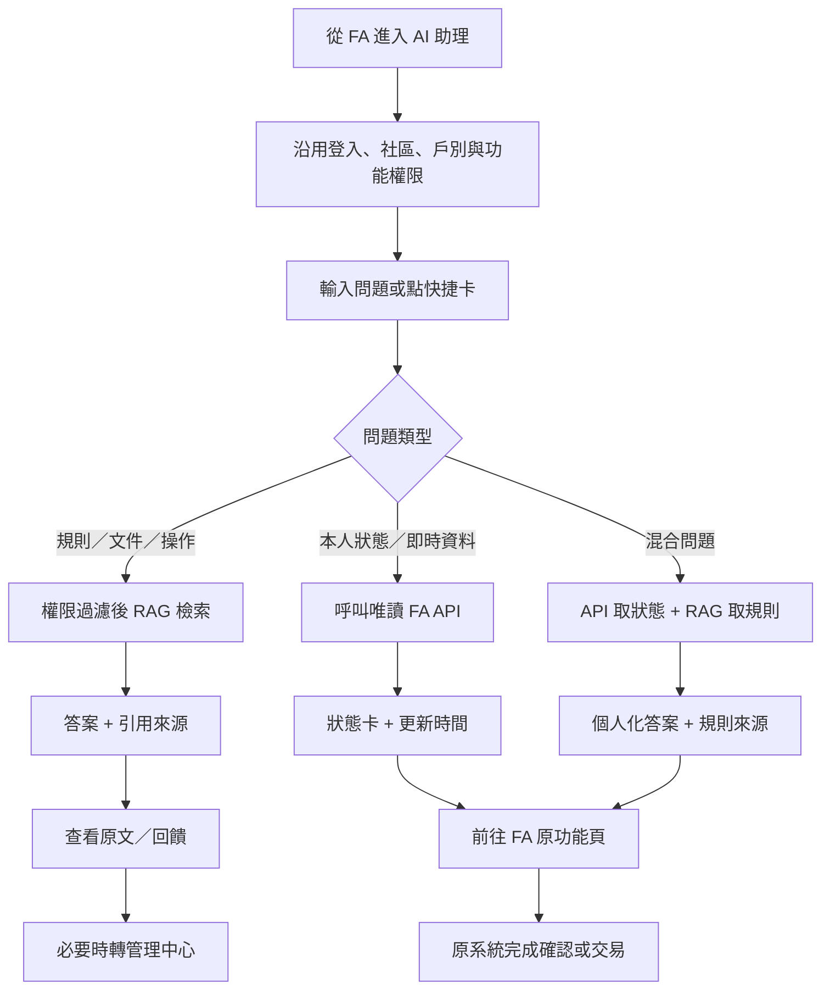
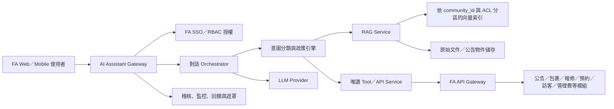

# FA AI Assistant 產品需求文件（PRD）

> 文件狀態：Draft v1.0  
> 分析基礎：《社區永續管理系統（FA）用戶手冊 1140424 V6》，共 197 頁  
> 產出日期：2026-07-14  
> 產品範圍：在既有 FA 系統上增加 AI 查詢與導覽能力，不取代 FA 核心交易系統

## 1. 產品摘要

FA 涵蓋 18 個模組，橫跨文件、公告、公設、報修、訪客、包裹、管理費、資產與社區治理。資訊分散在不同分頁、文件與案件狀態中；住戶想知道「我的包裹到了嗎」「報修到哪一步」「公設何時有空」，管理人員則常需要跨模組追蹤待辦、查找規則與回覆住戶。

FA AI Assistant 的第一階段定位是「有權限、可溯源、以查詢為主的社區助理」：

- 用 RAG 回答社區規約、公告、生活資訊、設備文件與維運計畫等知識型問題。
- 用 API 查詢住戶本人或管理者權限範圍內的即時狀態與結構化資料。
- 將答案導回既有 FA 功能頁，交易仍由原系統完成。
- 不在 MVP 內讓 AI 自動付款、投票、開門、刪除資料或替管理者做高風險決策。

## 2. 分析範圍與前提

### 2.1 手冊涵蓋模組

| 代號 | 模組 | 手冊頁碼 | 主要資料型態 |
|---|---|---:|---|
| A | 文件管理 | 3–8 | 文件、分類、權限 |
| B | 瓦斯抄錶 | 9–16 | 當期任務、度數、通知 |
| C | 生活資訊 | 17–21 | 分類式知識內容 |
| D | 住戶資訊 | 22–38 | 住戶個資、帳號綁定、權限、門禁 |
| E | 社區公告 | 39–45 | 公共／個人訊息、附件、已讀狀態 |
| F | 公設預約 | 46–65 | 設施、時段、點數、預約紀錄 |
| G | 社區投票 | 66–73 | 議題、選項、投票與結果 |
| H | 社區報修 | 74–89 | 案件、對話、報價、付款、結案 |
| I | 首頁輪播 | 90–94 | 圖片與外部連結 |
| J | 組織管理 | 95–116 | 人員、權限、廠商、門禁、出勤 |
| K | 訪客預約 | 117–137 | 訪客、QR Code、車位、進出紀錄 |
| L | 郵件包裹 | 138–148 | 收件、簽收、退貨、寄件 |
| M | 意見反映 | 149–156 | 匿名／具名案件與回覆 |
| N | 資產管理 | 157–178 | 資產、保養、維修、報廢、廠商 |
| O | 管理費 | 179–181 | 應繳、繳款網址、繳款紀錄 |
| P | 維運管理 | 182–187 | 計畫文件、提醒、權限 |
| Q | 績效評估 | 188–190 | 評估項目、提醒、評分紀錄 |
| R | 租售管理 | 191–196 | 刊登與詳細內容 |

### 2.2 分析限制

- 手冊描述功能與操作，未提供實際使用量。因此「最常使用」為依日常頻率、時效性與角色覆蓋面推估，正式排程前應以 FA 操作日誌、客服紀錄及 5–10 個社區訪談驗證。
- 手冊未提供既有 API、資料庫 schema、SSO、推播服務或多社區租戶模型；本 PRD 的 API 與架構為產品需求，不代表現況已具備。
- 「管理端」不是單一固定權限。手冊顯示管理委員及外部物業人員可被逐項授權，因此 AI 必須沿用 FA 的實際 RBAC，而不能只判斷「管理者／住戶」。

## 3. 使用者與角色

### 3.1 主要登入角色

| 角色 | 主要目標 | 常見任務 | AI 權限原則 |
|---|---|---|---|
| 住戶／所有權人 | 快速取得本人、戶別及社區資訊 | 看公告、領包裹、預約公設、報修、訪客預約、管理費、投票 | 僅可查本人／所屬戶別與公開給住戶的內容 |
| 租客 | 完成日常居住服務 | 公告、公設、報修、包裹、訪客 | 依租客身份及戶別綁定權限；不可因同戶而推定可看所有所有權資料 |
| 管理中心／物業人員 | 處理高頻營運工作 | 包裹、訪客、公告、報修、住戶服務 | 依被授予的功能權限查詢；個資欄位預設遮罩 |
| 管理委員 | 治理、監督與決策 | 公告、投票、財務／管理費、維運、資產、績效 | 依職務與模組權限；敏感清冊與個人投票資料需額外管控 |
| 系統／社區管理者 | 維護帳號、角色與設定 | 人員、職稱、類別、文件權限、門禁、整合設定 | 可管理 AI 資料來源與稽核，但仍不得繞過租戶隔離 |

### 3.2 次要角色或業務對象

- 外部物業管理人員：可綁定管理中心帳號並取得指定功能權限。
- 廠商／維修人員：手冊中主要是被管理的資料與聯絡對象，不一定直接登入；未來可有受限工單入口。
- 訪客：由住戶或管理端代為登記，通常不是完整登入角色。
- 管理中心值班／櫃台：是物業人員的高頻工作情境，特別集中於訪客、包裹、門禁與報修。
- 稽核／交接人員：需要查閱資產、維運、出勤、歷屆管委會與操作紀錄，建議採唯讀權限。

## 4. 最常使用的功能（推估）

### 4.1 第一梯隊：高頻且高時效

1. 社區公告與個人訊息：所有住戶都可能使用，且具有未讀、搜尋、附件與推播情境。
2. 郵件包裹：管理中心每日登錄、簽收、退貨；住戶高頻查詢是否有未領包裹。
3. 訪客預約：住戶預約、櫃台確認抵達／離開、QR Code 與車位均要求即時狀態。
4. 社區報修：案件生命週期長，住戶與管理端需反覆查看狀態、訊息、報價與完工。
5. 公設／活動預約：需要查規則、可用時段、點數餘額與本人預約。
6. 管理費：週期性但觸及全體住戶，「是否已繳、金額、期限、繳款連結」查詢價值高。

### 4.2 第二梯隊：週期性或管理端高價值

- 瓦斯抄錶、社區投票、意見反映。
- 資產保養／維修／檢驗、維運計畫與提醒。
- 住戶／組織／權限管理。

### 4.3 第三梯隊：低頻或偏設定維護

- 文件／生活資訊的建立與分類管理。
- 首頁 Logo／輪播管理、類別排序、職稱管理。
- 績效評估、租售刊登、歷屆管委會文件維護。

## 5. 適合 AI 查詢的功能

### 5.1 最適合的查詢場景

| 場景 | 使用者問題範例 | 回答方式 | 價值 |
|---|---|---|---|
| 社區知識問答 | 「裝修時段到幾點？」「垃圾怎麼分類？」 | RAG，附文件／公告來源與日期 | 降低管理中心重複回覆 |
| 個人待辦摘要 | 「我今天有什麼要處理？」 | API 彙整未領包裹、未繳管理費、抄錶、預約、投票等 | 一次跨模組取得重點 |
| 案件進度 | 「我的漏水報修到哪了？」 | API 查案件狀態；RAG 解釋流程 | 減少追問、提升透明度 |
| 預約查詢 | 「明晚健身房有空嗎？我有多少點？」 | API 查即時時段與點數；RAG 回答規則 | 縮短找頁與比對時間 |
| 公告摘要 | 「最近一週有哪些重要公告？」 | API 取有權限公告，AI 摘要並連回原文 | 解決資訊過載 |
| 包裹／訪客狀態 | 「我有未領包裹嗎？」「今晚訪客 QR Code 還有效嗎？」 | API 即時查詢 | 高頻、答案明確 |
| 管理端營運摘要 | 「今天有哪些逾期或待處理案件？」 | API 跨模組聚合 | 幫助值班交接與優先排序 |
| 資產維運查詢 | 「30 天內哪些設備要保養？上次電梯維修是何時？」 | API 查結構化紀錄；RAG 查保固書與計畫 | 降低漏保養風險 |
| 表單導覽 | 「我要申請訪客車位怎麼做？」 | RAG／流程知識 + 深連結 | 降低操作學習成本 |

### 5.2 不適合只靠自然語言回答的場景

- 需要強烈法律效力或不可否認性的投票、付款、簽收與門禁放行。
- 涉及刪除、解除委任、報廢、取消全體預約等不可逆或高影響操作。
- AI 自行判斷匿名意見的真實身份、住戶信用、違規或黑名單資格。
- 未經人工確認即對外發送公告、個人訊息、推播或聯絡廠商。

## 6. API 與 RAG 邊界

### 6.1 判斷原則

- 問題若涉及「現在、我的、尚未、餘額、狀態、可用時段、是否已讀／已繳」，必須查 API。
- 問題若涉及「規定、辦法、文件內容、如何操作、過去公告說了什麼」，可由 RAG 回答。
- 同一問題可同時需要兩者。例如「我可以取消明天的公設預約嗎？」需 API 取得該筆預約與取消期限，再由規則資料解釋原因。
- RAG 不能當成資料庫，也不能用索引中的舊快照回答即時狀態。

### 6.2 功能分類矩陣

| 模組／能力 | RAG | API | 說明 |
|---|:---:|:---:|---|
| 文件管理 | 必要 | 建議 | 內容問答靠 RAG；檔案清單、權限、生失效日由 API 驗證 |
| 生活資訊 | 必要 | 建議 | 內容適合 RAG；有效內容與分類可由 API 同步 |
| 社區公告 | 必要 | 必要 | 摘要／搜尋用 RAG；個人訊息、未讀與有效期用 API |
| 維運計畫／歷屆文件 | 必要 | 建議 | 文件內容問答為主；權限、提醒、版本由 API |
| 公設規則／報修流程／訪客辦法 | 必要 | 否 | 純制度與操作說明可只用 RAG |
| 瓦斯抄錶 | 否 | 必要 | 當期是否開放、截止日、是否已填皆是即時資料 |
| 住戶／組織／權限 | 否 | 必要 | 結構化且高度敏感，禁止進一般向量索引 |
| 公設／活動預約與點數 | 輔助 | 必要 | 規則用 RAG；時段、名額、餘額與本人紀錄用 API |
| 社區投票 | 輔助 | 必要 | 議題說明可 RAG；資格、是否已投、結果必須 API |
| 社區報修 | 輔助 | 必要 | FAQ／保固說明用 RAG；案件、對話、報價、付款用 API |
| 首頁輪播 | 否 | 非 MVP | AI 價值低 |
| 訪客預約／QR Code／車位 | 輔助 | 必要 | 即時且涉及門禁；AI 僅查詢與導覽 |
| 郵件包裹 | 否 | 必要 | 狀態、簽收與退貨皆為交易資料 |
| 意見反映 | 否 | 必要 | 案件與匿名性敏感，不進共用 RAG |
| 資產管理 | 輔助 | 必要 | 保固書與手冊可 RAG；資產狀態、保養日與紀錄用 API |
| 管理費 | 否 | 必要 | 金額、期限、繳款狀態與連結必須即時查詢 |
| 績效評估 | 輔助 | 建議 | 評估規則可 RAG；分數與歷史紀錄用 API |
| 租售管理 | 輔助 | 建議 | 公開刊登可檢索；建立／編輯／刪除仍由 API／原頁面 |

### 6.3 只需要 RAG 的首波知識範圍

- FA 操作手冊與常見問題。
- 對住戶開放的社區規約、管理辦法、生活資訊。
- 對該角色可讀的公共公告、維運計畫與設備使用說明。
- 公設使用規則、報修流程、訪客換證／QR Code 說明、包裹領取／退貨流程。

純 RAG 回答仍須套用 `community_id`、角色與文件閱讀權限；引用需包含文件名、章節／頁碼或公告標題、發布日期與深連結。

### 6.4 必須 API 化的首波資料

- 身份、社區、戶別與細粒度權限。
- 未讀公告／個人訊息與有效公告清單。
- 未領包裹及狀態。
- 本人報修案件與進度。
- 公設可用時段、本人預約、取消資格、點數餘額。
- 訪客預約與 QR Code 有效狀態（不得讓模型看到可重放的門禁密鑰）。
- 當期管理費金額、期限、繳款狀態及可信任的繳款深連結。
- 當期瓦斯抄錶狀態。
- 管理端待處理／逾期案件彙整。

## 7. MVP 第一版

### 7.1 MVP 目標

讓住戶與管理人員能在 30 秒內，以一句自然語言取得「可信、具權限、可追溯」的答案或正確入口，優先減少公告、包裹、報修、公設、訪客與管理費的重複查找。

### 7.2 必做功能

1. **沿用 FA 登入與權限**：取得 `user_id`、`community_id`、戶別、角色與模組權限；所有檢索與工具呼叫先授權。
2. **知識問答 RAG**：索引操作手冊、社區規約、住戶可讀文件、生活資訊與有效公共公告；答案強制附來源。
3. **住戶個人查詢工具**：
   - 未讀／近期公告摘要。
   - 未領包裹。
   - 本人報修狀態。
   - 本人公設預約、可用時段、點數餘額。
   - 本人訪客預約狀態。
   - 當期管理費與瓦斯抄錶狀態。
4. **管理端今日待辦摘要**：依既有功能權限彙整未處理報修、未領包裹、今日訪客、逾期抄錶、待處理資產等數量，並深連結到原模組。
5. **混合問答路由**：能分辨知識、即時資料與混合問題；資料不足時明確說明，不猜測。
6. **深連結與下一步**：答案卡片提供「查看公告」「前往預約」「查看報修」等原系統入口。
7. **基本追問能力**：在同一會話保留使用者已選定的案件／設施，但每次 API 呼叫仍重新驗證權限。
8. **回饋與稽核**：有用／無用、原因回報、查詢類型、引用來源、工具呼叫與授權結果；敏感值遮罩。
9. **管理介面最小集**：資料來源啟停、重新索引、失敗狀態、熱門未解問題與稽核查詢。

### 7.3 MVP 驗收條件

- 權限測試：跨社區、跨戶別、住戶讀管理端文件皆為 0 筆資料外洩。
- 有來源的知識回答率 ≥ 95%；無可靠來源時明確拒答或導向人工。
- 個人狀態查詢與 FA 原頁面一致率 ≥ 99.5%。
- Top 20 問題任務成功率 ≥ 85%。
- 一般回答 P95 ≤ 5 秒；跨模組摘要 P95 ≤ 8 秒。
- 至少 60% 的試用者能不經教學完成「查公告／包裹／報修／公設」任一任務。
- 高風險交易工具數量為 0；所有可操作入口均導回既有 FA 確認頁。

## 8. MVP 不應該做的功能

- 不直接代替住戶付款、投票、填寫瓦斯度數、簽收包裹或開啟門禁。
- 不由 AI 建立、取消或修改公設／訪客預約；MVP 只查詢並導頁。
- 不自動建立／結案報修、接受報價、確認付款、報廢資產或取消全體預約。
- 不自動發布公告、回覆意見、對住戶／廠商發送訊息或推播。
- 不建立通用「資料庫問答」讓模型自由生成 SQL。
- 不把住戶個資、匿名意見全文、門禁資料、簽名、付款資料或個人投票選擇放進共用向量庫。
- 不做人臉辨識、訪客風險評分、住戶信用評分、情緒監控或黑名單建議。
- 不在第一版處理 Logo／輪播、職稱／類別排序、Excel 大量匯入、出勤打卡、租售刊登編輯等低 AI 價值功能。
- 不承諾取代管理中心人工客服；超出資料或權限範圍時應清楚轉人工。

## 9. 建議 UI Flow

### 9.1 入口與首頁

- 在既有 FA 手機版底部或首頁提供固定「AI 助理」入口，沿用已登入身份，不再要求輸入社區或戶別。
- 首畫面依角色顯示 4–6 個動態快捷卡：
  - 住戶：近期公告、未領包裹、報修進度、公設空位、管理費、訪客。
  - 管理端：今日訪客、待處理報修、未領包裹、逾期任務、資產保養、公告草稿入口。
- 同時保留自由輸入框與範例問題，避免只有聊天框而不知道能問什麼。

### 9.2 核心流程

### 9.3 回答元件

- **知識答案卡**：簡短答案、適用對象、來源、發布／更新日、查看原文。
- **狀態卡**：狀態、關鍵日期、最後更新時間、案件／預約編號、原頁入口。
- **清單卡**：最多顯示 3–5 筆並可展開，避免長篇聊天文字。
- **風險確認提示**：若使用者要求付款、投票、刪除或門禁操作，說明 AI 不直接執行並導至正式頁面。
- **資料範圍提示**：例如「以下為 A 社區、A 棟 10 樓、你的帳號可查看內容」。

## 10. 建議系統架構

### 10.1 邏輯架構

### 10.2 關鍵設計

1. **AI Gateway**：處理身份、速率限制、會話、輸入驗證與輸出遮罩。
2. **政策引擎先於模型**：授權由程式碼與 FA RBAC 決定，模型不能自行選擇可看的社區、戶別或欄位。
3. **唯讀工具白名單**：每個工具有固定 schema，例如 `get_my_packages`、`get_my_repairs`、`search_facility_slots`；禁止任意 SQL 與任意 URL。
4. **多租戶 RAG**：索引至少以 `community_id` 分區，chunk metadata 含文件 ACL、角色、戶別範圍、生失效日、版本、來源 URL。
5. **先授權再檢索**：ACL 過濾必須在取回 chunk 前完成，不能先召回敏感內容再要求模型忽略。
6. **內容同步**：文件／公告新增、修改、失效、刪除時送事件更新索引；每日對帳修復漏同步。
7. **可觀測性**：記錄意圖、延遲、引用、工具名稱、錯誤碼與回饋；不記錄完整 QR Code、簽名、付款憑證等秘密。
8. **降級策略**：LLM 或向量服務異常時，仍可顯示快捷入口與原系統搜尋；API 超時則不使用舊值冒充即時資料。

### 10.3 建議 API 契約

所有 API 應由後端根據登入 token 推導使用者與社區，不接受模型自由指定 `user_id` 或 `community_id`。回傳共同欄位：`as_of`、`source_url`、`permission_scope`、`data_version`。

MVP 建議端點：

- `GET /assistant/context`
- `GET /assistant/announcements?scope=my&unread=true`
- `GET /assistant/packages?status=unclaimed`
- `GET /assistant/repairs?scope=my&status=open`
- `GET /assistant/facilities/{id}/slots?date=...`
- `GET /assistant/reservations?scope=my`
- `GET /assistant/points/balance`
- `GET /assistant/visitors?scope=my&status=active`
- `GET /assistant/management-fee/current`
- `GET /assistant/gas-meter/current`
- `GET /assistant/admin/today-summary`（需細粒度管理權限）

### 10.4 安全與隱私

- 遵循最小權限、租戶隔離、欄位遮罩、傳輸／靜態加密與稽核保留政策。
- 個資類回答預設只顯示必要欄位；管理端若要完整查看，導回 FA 原頁並使用既有「眼睛」揭露機制。
- 防 prompt injection：外部文件內容視為不可信資料，不得改寫系統規則或觸發工具。
- 引用的原始文件在點擊時再次驗證權限，不能把具永久公開性的檔案 URL 放進回答。
- QR Code 僅回傳「有效／失效／使用方式」及受保護的原頁入口；不可進模型上下文或日誌。
- 匿名意見維持匿名：AI 不提供推測、關聯或去匿名化能力。

## 11. 成功指標

### 11.1 北極星指標

每週「成功自助解決的有效查詢數」：使用者取得有來源或與 FA 一致的答案，且未在短時間內重問／轉人工。

### 11.2 產品指標

- 查詢任務成功率、首次回答解決率、引用點擊率、深連結完成率。
- 管理中心重複詢問量與平均處理時間的下降幅度。
- 公告閱讀率、包裹逾期未領時間、報修追問次數的改善。
- 無答案率、錯誤工具路由率、資料不一致率與 P95 延遲。
- 權限／隱私事件數（目標 0）。

### 11.3 建議試點門檻

- 先選 2–3 個資料較完整、管理團隊願意回饋的社區。
- 每個角色至少 10 位測試者，連續試用 4 週。
- 上線前建立 Top 100 真實問題測試集，包含跨戶、跨社區、過期文件、匿名意見、門禁 QR Code 等負向案例。

## 12. Roadmap

### Phase 0：資料與介面盤點（2–4 週）

- 盤點 SSO／RBAC、社區與戶別關係、18 模組資料擁有者及現有 API。
- 取得匿名化操作日誌，驗證高頻功能排序。
- 定義文件 ACL、版本、生失效日與刪除同步機制。
- 建立 Top 100 問題、權限測試與資料一致性基準。

### Phase 1：MVP 唯讀助理（6–10 週）

- 上線操作手冊＋社區文件／公告 RAG。
- 串接公告、包裹、報修、公設、訪客、管理費、瓦斯等唯讀 API。
- 提供住戶個人查詢、管理端今日摘要、來源引用、深連結與回饋。
- 以 2–3 個社區封閉試點，人工監看無答案與錯誤案例。

### Phase 2：主動提醒與更完整營運（6–8 週）

- 由明確規則觸發的個人化提醒：未領包裹、抄錶截止、管理費期限、預約將至、資產保養。
- 擴充投票、意見反映、資產與維運的唯讀查詢。
- 建立管理端交接摘要、趨勢與 SLA 報表。
- 提供繁中優化、語音輸入與無障礙介面；仍不自動執行高風險交易。

### Phase 3：受控寫入與協作（8–12 週）

- AI 協助預填報修、訪客、公設預約或公告草稿，但必須在 FA 正式表單逐欄確認後送出。
- 使用 idempotency key、二次確認、操作摘要與完整稽核。
- 對管理端提供回覆草稿、公告摘要與文件標籤建議；發送仍由人員確認。
- 視需求建立受限廠商工單入口。

### Phase 4：預測與最佳化（持續）

- 在資料品質與治理成熟後，進行資產保養風險、報修量與公設需求預測。
- 提供社區永續／績效指標解釋與改善建議，保留依據與人工覆核。
- 跨社區只能使用去識別化、聚合資料做標竿分析，不得洩漏單一社區或住戶資訊。

## 13. 主要風險與對策

| 風險 | 影響 | 對策 |
|---|---|---|
| 細粒度權限不完整 | 嚴重資料外洩 | 先完成 RBAC／ACL API；無權限資訊不得進模型上下文 |
| 文件過期或版本混亂 | 回答錯誤規則 | 生失效日、版本與權威來源排序；答案顯示更新日 |
| API 與畫面資料不同步 | 使用者失去信任 | 回傳 `as_of` 與版本；建立自動對帳與一致性告警 |
| 模型幻覺 | 錯誤指引 | 強制引用、低信心拒答、固定工具 schema、Top 100 回歸測試 |
| Prompt injection | 越權或錯誤工具呼叫 | 文件不可信隔離、政策引擎、工具白名單與輸出驗證 |
| 使用者誤以為已完成交易 | 漏繳／漏預約等損失 | 清楚標示「查詢結果」；交易一律導回 FA 確認頁與成功憑證 |
| 個資進入模型或日誌 | 法遵與信任風險 | 最小欄位、遮罩、短保存、供應商資料政策與刪除流程 |
| 高頻問題假設錯誤 | MVP 使用率低 | 操作日誌、客服分類與試點訪談驗證，兩週一次調整快捷卡 |

## 14. 待確認事項

1. 既有 FA 是否有正式 API、事件通知、OpenAPI 文件與測試環境？
2. 登入 token 是否能取得多社區、多戶別、租客／所有權人與逐模組權限？
3. 公告、文件、維運計畫的閱讀權限是否已落到可查詢的 ACL？
4. 推播服務、TA 門禁／QR Code、繳款網址各自的供應商與安全限制為何？
5. 個人訊息、匿名意見、投票選擇、簽名與出勤資料的保存及稽核政策為何？
6. 哪些社區可作試點？其文件數量、掃描件比例、常用語言與客服量為何？
7. 目前最常見的 50 個客服問題與各模組月活／操作量為何？
8. AI 模型與資料需部署在公有雲、私有雲或台灣區域的限制為何？

## 15. 結論

FA AI Assistant 的最佳起點不是重做 18 個模組，而是在既有 FA 之上建立一層安全的「查詢、解釋、摘要、導覽」。MVP 應以 RAG 解決規則與文件搜尋，以唯讀 API 解決個人即時狀態，並把所有交易留在原系統。這條路徑可用較低風險驗證使用價值，同時為後續主動提醒、受控表單預填與營運分析建立可靠的權限、資料與稽核基礎。
